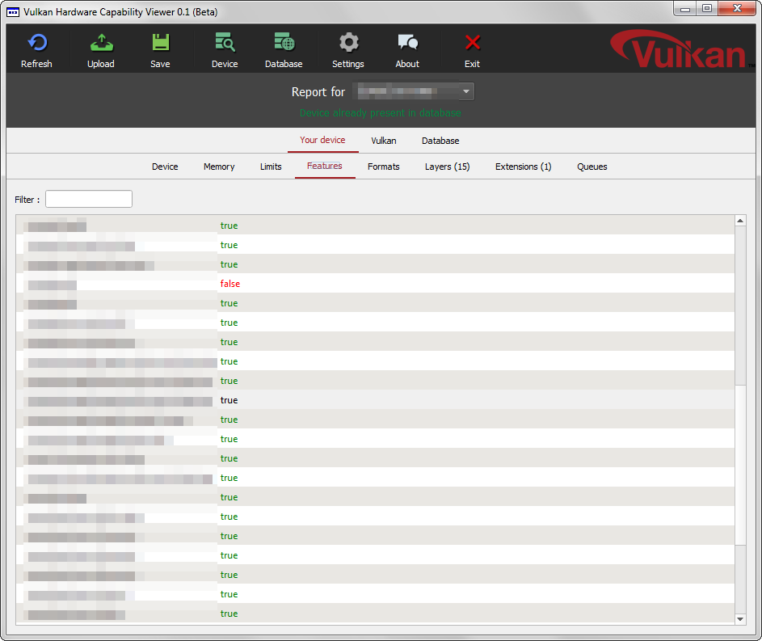

# Vulkan Hardware Capability viewer

Displays hardware reports for GPUs supporting the new [Vulkan(tm)](https://www.khronos.org/vulkan]) API by Khronos.

Reports can then be submitted to the [online database](http://http://vulkan.gpuinfo.org/).

# Dependencies
The following frameworks and headers are required to compile and build :

- Vulkan - tbd
- Qt - https://qt-project.org/

# Building
The repository includes a CMakeLists.txt for use with https://cmake.org/
