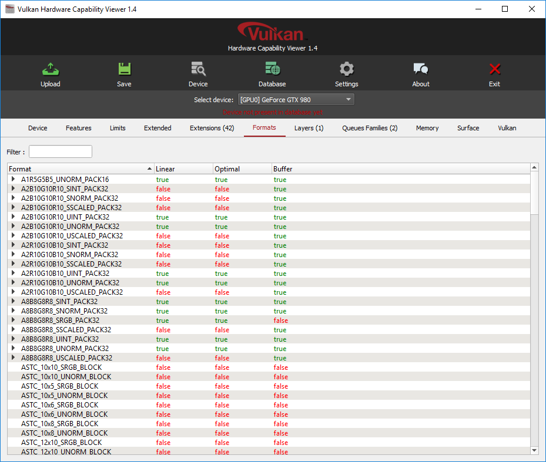
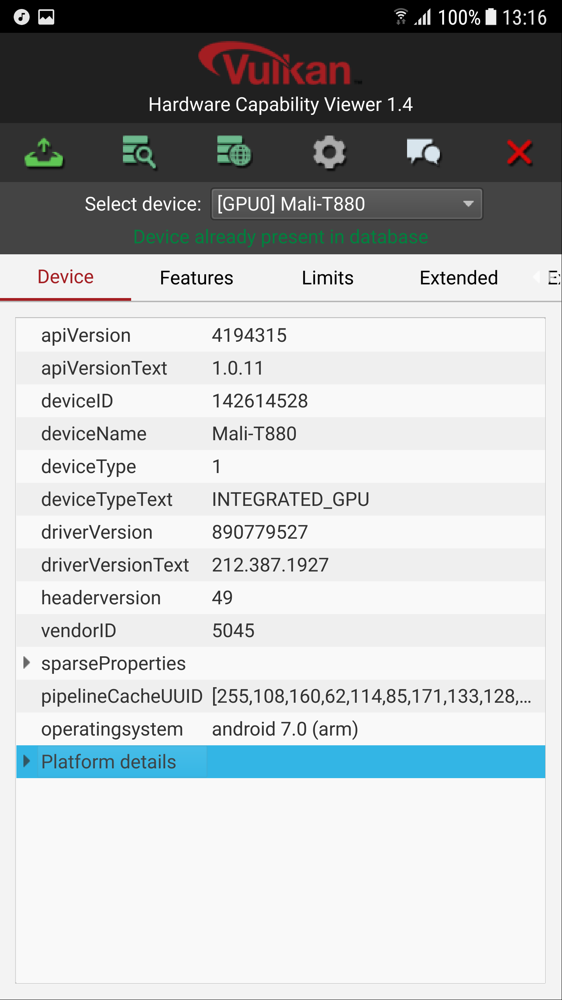

# Vulkan Hardware Capability Viewer

Client application to display hardware implementation details for GPUs supporting the [Vulkan](https://www.khronos.org/vulkan/) API by Khronos.

The hardware reports can be submitted to a public [online database](http://vulkan.gpuinfo.org/) that allows comparing different devices, browsing available features, extensions, formats, etc.

 

# Supported platforms
**A Vulkan compatible device is required**
- Windows (x64)
- Linux (x64)
- Android (Including Android TV)
- Mac OS X

# Building

The repository includes a project file for the [Qt Creator IDE](https://www.qt.io/ide/) that has been tested to work with Windows, Linux and Android. This is the preferred (and easiest) way of building the application if you want to build it yourself. Using the [Qt Visual Studio Tools](https://marketplace.visualstudio.com/items?itemName=TheQtCompany.QtVisualStudioTools2019), it's also possible to use a current Visual Studio version.
Alternatively, you can simply run `qmake` followed by `make` in the source directory.

# Releases
Current releases for all platforms will be provided on a regular basis at [vulkan.gpuinfo.org/download.php](https://vulkan.gpuinfo.org/download.php).

# Dependencies
- [Vulkan SDK](https://vulkan.lunarg.com/)
- [Qt 5.12](https://www.qt.io/developers/) - Older versions may not work due to missing functionality
